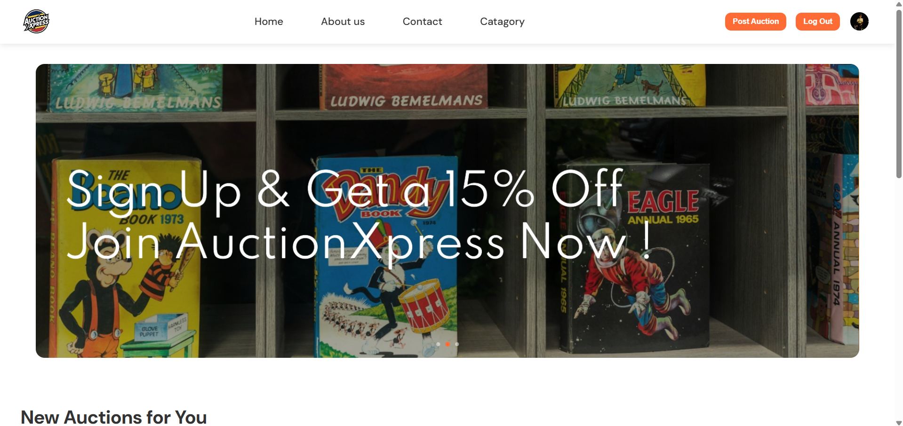
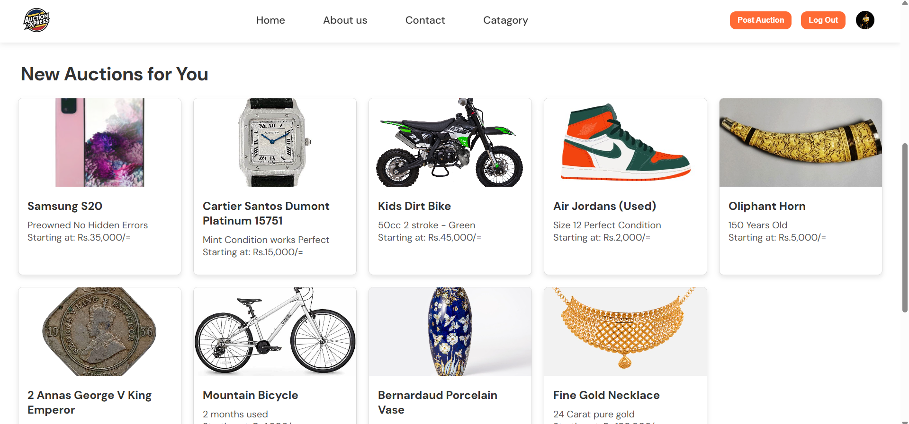
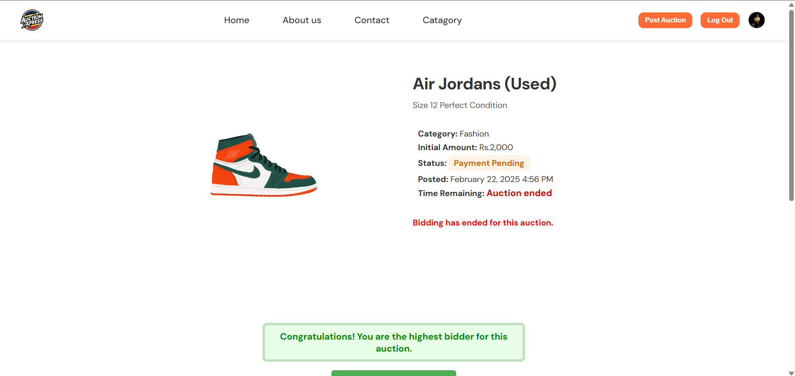

# AuctionXpress 🏆

An auctioning online portal which eliminates manual process into a seamless online experience.

## 📋 Table of Contents
- [Overview](#overview)
- [Features](#features)
- [Tech Stack](#tech-stack)
- [Installation](#installation)
- [Usage](#usage)
- [API Documentation](#api-documentation)
- [Screenshots](#screenshots)
- [Contributing](#contributing)
- [License](#license)
- [Contact](#contact)

## 🎯 Overview

AuctionXpress is a modern, full-stack online auction platform that transforms traditional manual auction processes into a streamlined digital experience. Users can create, manage, and participate in auctions with real-time bidding capabilities, secure payment processing, and comprehensive auction management tools.

## ✨ Features

### 🔐 User Management
- User registration and authentication
- Profile management and verification
- Role-based access control (Bidders, Sellers, Admins)
- Password reset and security features

### 🏷️ Auction Management
- Create and list auction items
- Set starting prices, reserve prices, and auction duration
- Category-based item organization
- Image upload and gallery management
- Auction scheduling and automatic closure

### 💰 Bidding System
- Real-time bidding with live updates
- Automatic bid increments
- Bid history and tracking
- Proxy/automatic bidding options
- Bid notifications and alerts

### 🔍 Search & Discovery
- Advanced search and filtering
- Category browsing
- Featured and trending auctions
- Watchlist and favorites
- Price range and location filters

### 📊 Analytics & Reporting
- User dashboard with statistics
- Auction performance metrics
- Bidding history and analytics
- Sales reports and revenue tracking

### 🔔 Notifications
- Real-time bid notifications
- Auction end alerts
- Email and SMS notifications
- System announcements

### 💳 Payment Integration
- Secure payment gateway integration
- Multiple payment methods
- Escrow services
- Transaction history
- Refund management

## 🛠️ Tech Stack

### Frontend
- **Framework**: [HTML]
- **Styling**: [CSS, Bootstrap]

### Backend
- **Runtime**: [Node.js]
- **Database**: [MySQL]

### Additional Services
- **Payment**: [Stripe]
- **Email**: [EmailJS]
- **Hosting**: [AwardSpace]
- **CDN**: [Cloudflare]

## 🚀 Installation

### Prerequisites
- Node.js (v14 or higher)
- npm or yarn
- Database (MongoDB/PostgreSQL/MySQL)
- Git

### Clone the Repository
```bash
git clone https://github.com/mohamedshiras/AuctionXpress.git
cd AuctionXpress
```

### Backend Setup
```bash
# Navigate to backend directory
cd backend

# Install dependencies
npm install

# Create environment file
cp .env.example .env

# Configure your environment variables
# Edit .env file with your database credentials, API keys, etc.

# Run database migrations (if applicable)
npm run migrate

# Start the server
npm start
```

### Frontend Setup
```bash
# Navigate to frontend directory
cd frontend

# Install dependencies
npm install

# Create environment file
cp .env.example .env

# Configure your environment variables
# Edit .env file with API endpoints, etc.

# Start the development server
npm start
```

### Environment Variables

Create a `.env` file in the root directory with the following variables:

```env
# Database Configuration
DB_HOST=localhost
DB_PORT=8080
DB_NAME=auctionxpress
DB_USER=your_db_user
DB_PASSWORD=your_db_password

# JWT Configuration
JWT_SECRET=your_jwt_secret
JWT_EXPIRES_IN=24h

# Payment Gateway
STRIPE_SECRET_KEY=your_stripe_secret_key
STRIPE_PUBLISHABLE_KEY=your_stripe_publishable_key

# Email Configuration
EMAIL_SERVICE=gmail
EMAIL_USER=your_email@gmail.com
EMAIL_PASS=your_email_password

# File Upload
CLOUDINARY_CLOUD_NAME=your_cloud_name
CLOUDINARY_API_KEY=your_api_key
CLOUDINARY_API_SECRET=your_api_secret

# Frontend URL
FRONTEND_URL=http://localhost:8080

```

## 📖 Usage

### For Bidders
1. **Register/Login**: Create an account or log in to existing account
2. **Browse Auctions**: Explore available auctions by category or search
3. **Place Bids**: Participate in auctions by placing bids
4. **Monitor**: Track your bids and auction status
5. **Payment**: Complete payment for won auctions

### For Sellers
1. **Create Account**: Register as a seller
2. **List Items**: Create auction listings with photos and descriptions
3. **Manage Auctions**: Monitor bids and manage your active auctions
4. **Complete Sales**: Process completed auctions and coordinate delivery

### For Administrators
1. **User Management**: Manage user accounts and permissions
2. **Auction Oversight**: Monitor and moderate auction activities
3. **Analytics**: View platform statistics and performance metrics
4. **Content Management**: Manage categories, featured items, and site content

## 📚 API Documentation

### Authentication Endpoints
```
POST /api/auth/register    - User registration
POST /api/auth/login       - User login
POST /api/auth/logout      - User logout
POST /api/auth/refresh     - Refresh access token
```

### Auction Endpoints
```
GET    /api/auctions       - Get all auctions
POST   /api/auctions       - Create new auction
GET    /api/auctions/:id   - Get auction by ID
PUT    /api/auctions/:id   - Update auction
DELETE /api/auctions/:id   - Delete auction
```

### Bidding Endpoints
```
POST   /api/bids           - Place a bid
GET    /api/bids/:auctionId - Get bids for auction
GET    /api/users/:id/bids - Get user's bidding history
```

### User Endpoints
```
GET    /api/users/profile  - Get user profile
PUT    /api/users/profile  - Update user profile
GET    /api/users/:id      - Get user by ID
```

For detailed API documentation, visit `/api/docs` when the server is running.

## 📱 Screenshots


### Homepage


### User Login


### User SignUp


### Auction Listing


### Bidding Interface



## 🤝 Contributing

We welcome contributions to AuctionXpress! Please follow these steps:

1. **Fork the Repository**
   ```bash
   git fork https://github.com/mohamedshiras/AuctionXpress.git
   ```

2. **Create a Feature Branch**
   ```bash
   git checkout -b feature/amazing-feature
   ```

3. **Commit Your Changes**
   ```bash
   git commit -m 'Add some amazing feature'
   ```

4. **Push to the Branch**
   ```bash
   git push origin feature/amazing-feature
   ```

5. **Open a Pull Request**

### Development Guidelines
- Follow the existing code style and conventions
- Write clear, concise commit messages
- Add tests for new features
- Update documentation as needed
- Ensure all tests pass before submitting

### Code of Conduct
Please read our [Code of Conduct](CODE_OF_CONDUCT.md) before contributing.

## 🐛 Bug Reports & Feature Requests

If you encounter any bugs or have feature requests, please:
1. Check existing issues to avoid duplicates
2. Create a new issue with detailed information
3. Use appropriate labels and templates
4. Provide steps to reproduce for bugs

## 🔧 Development Setup

### Database Setup
```bash
# For MongoDB
mongod --dbpath /path/to/your/db

# For PostgreSQL
createdb auctionxpress
```

### Running Tests
```bash
# Backend tests
cd backend
npm test

# Frontend tests
cd frontend
npm test

# Integration tests
npm run test:integration
```

### Building for Production
```bash
# Build frontend
cd frontend
npm run build

# Build backend (if applicable)
cd backend
npm run build
```

## 📋 Roadmap

- [ ] Mobile application (React Native/Flutter)
- [ ] Multi-language support
- [ ] Advanced analytics dashboard
- [ ] AI-powered price recommendations
- [ ] Integration with social media platforms
- [ ] Blockchain-based auction verification
- [ ] Video auction streaming
- [ ] Advanced fraud detection

## 📄 License

This project is licensed under the MIT License - see the [LICENSE](LICENSE) file for details.

## 📞 Contact

**Mohamed Shiras**
- GitHub: [@mohamedshiras](https://github.com/mohamedshiras)
- Email: [mchiya1003@gmail.com]
- LinkedIn: [https://www.linkedin.com/in/mohamedshiras/]

## 🙏 Acknowledgments

- Thanks to all contributors who have helped with this project
- Special thanks to the open-source community for the amazing tools and libraries
- Inspiration from various auction platforms and their innovative features

## 📊 Project Statistics


---

⭐ **Star this repository if you find it helpful!**

Made with ❤️ by [Mohamed Shiras](https://github.com/mohamedshiras)
